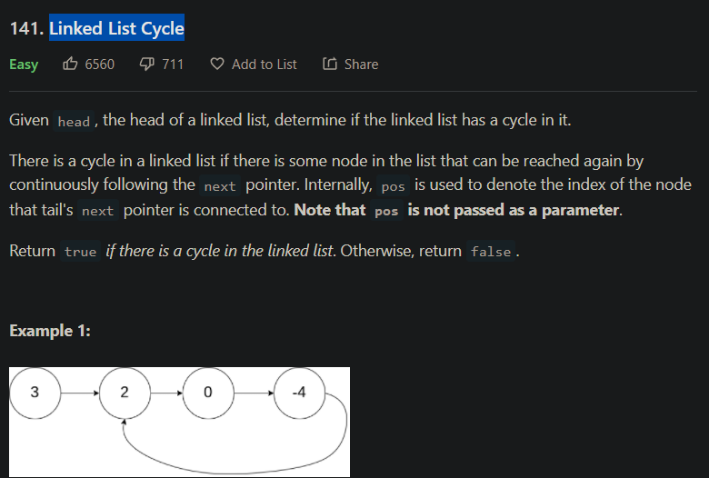

(141) Linked List Cycle
===========================



解法如下：
```python
# Definition for singly-linked list.
# class ListNode:
#     def __init__(self, x):
#         self.val = x
#         self.next = None

class Solution:
    def hasCycle(self, head: Optional[ListNode]) -> bool:
        fast = head
        slow = head
        while fast != None and fast.next != None:
            slow = slow.next
            fast = fast.next.next
            if fast == slow:
                return True

        return False
```
心得：
- 藉由快慢指標來確認是否有Cycle list，若有Cycle發生，則快慢指標一定會重疊，若無快指標一定會等於 NULL
