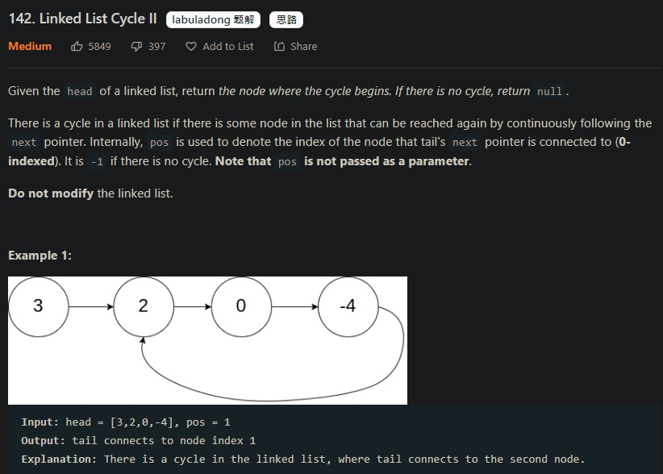

142 Linked List Cycle2
===========================
若有Cycle發生，回傳發生的那個Node，若沒有Cycle則回傳None


解法如下：
```python
# Definition for singly-linked list.
# class ListNode:
#     def __init__(self, x):
#         self.val = x
#         self.next = None

class Solution:
    def detectCycle(self, head: Optional[ListNode]) -> Optional[ListNode]:
        slow = head
        fast = head
        while fast and fast.next:
            fast = fast.next.next
            slow = slow.next
            if fast == slow:
                break

        if fast == None or fast.next == None:
            return None

        fast = head
        while fast != slow:
            fast = fast.next
            slow = slow.next

        return fast
```
心得：
- 如下圖，把快慢指针中的任一个重新指向 head，然后两个指针同速前进，k - m 步后一定会相遇，相遇之处就是环的起点了
- 個人覺得這題算是數學解


