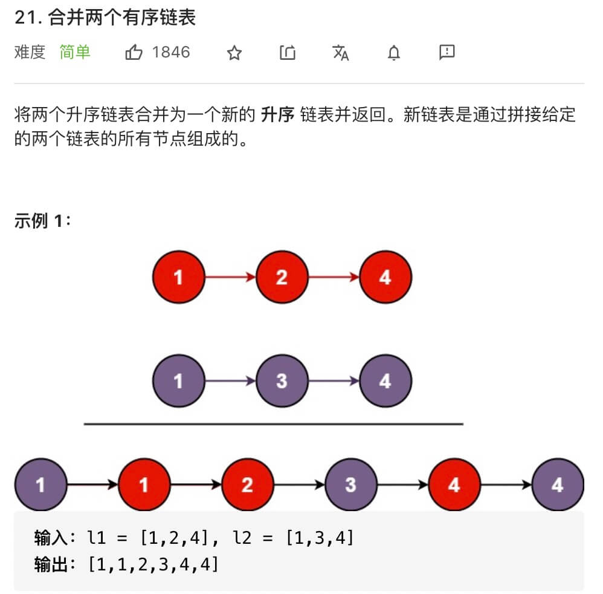
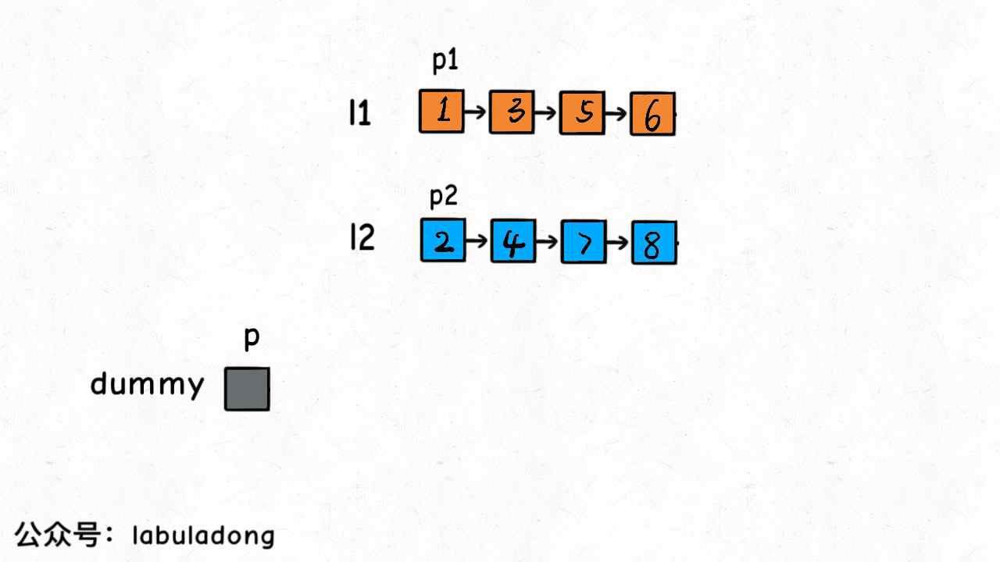

21 Merge Two Sorted Lists
===========================



解法如下：
```python
# Definition for singly-linked list.
# class ListNode:
#     def __init__(self, val=0, next=None):
#         self.val = val
#         self.next = next
class Solution:
    def mergeTwoLists(self, list1: Optional[ListNode], list2: Optional[ListNode]) -> Optional[ListNode]:
        dummy = ListNode()
        p = dummy
        p1 = list1
        p2 = list2

        while p1 and p2:
            # 比较 p1 和 p2 两个指针
            # 将值较小的的节点接到 p 指针
            if p1.val <= p2.val:
                p.next = p1
                p1 = p1.next
            else:
                p.next = p2
                p2 = p2.next

            # p 指针不断前进
            p = p.next

        if p1:
            p.next = p1

        if p2:
            p.next = p2

        return dummy.next
```
心得：
- 透過 one pointer P 的移動來串起整個鏈
- 藉由 dummy head 可以大幅降低代碼複雜度，不用處裡 P 一開始要先等於誰的問題

