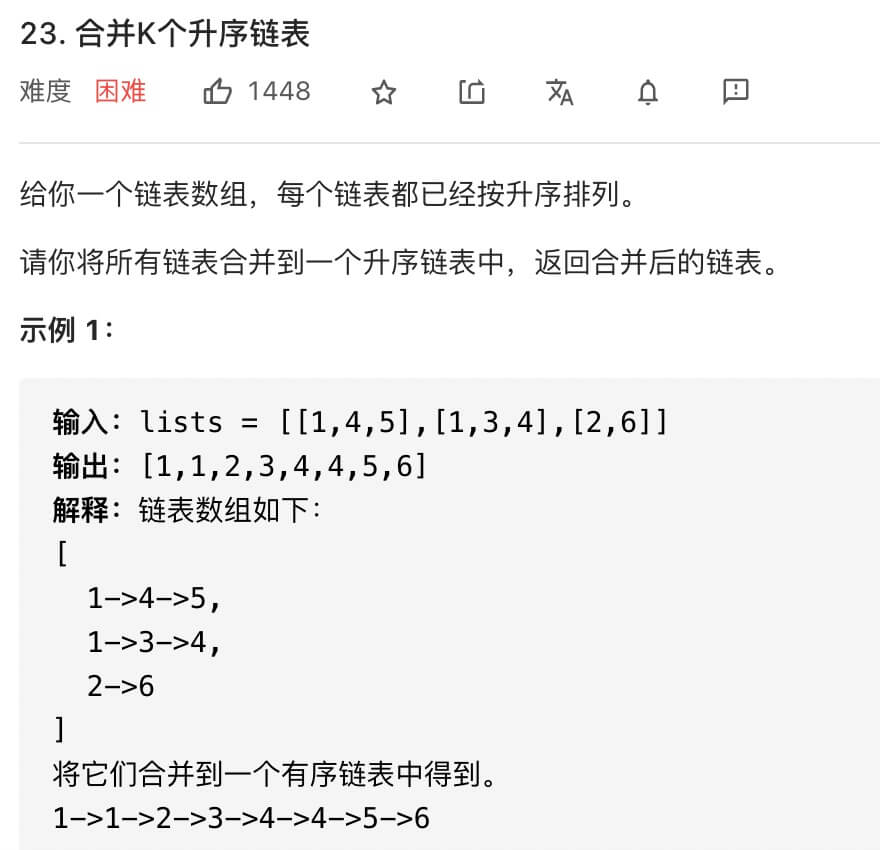

23 Merge K Sorted Lists
===========================



解法如下：
```python
# Definition for singly-linked list.
# class ListNode:
#     def __init__(self, val=0, next=None):
#         self.val = val
#         self.next = next
def mergeKLists(self, lists: List[Optional[ListNode]]) -> Optional[ListNode]:
    heapQueue = []
    for index, l in enumerate(lists):
        if l:
            # 由於 headQueue 的比對方式是 第一個 item 一樣就比第二個，而ListNode本身無法比對
            # 故當 val 一樣時拿 index 來比，誰先誰後都不重要
            heappush(heapQueue, (l.val, index, l))

    dummy = ListNode(0)
    p = dummy

    while heapQueue:
        v, index, node = heappop(heapQueue) # heappop 會從 Queue 中消失
        p.next = node
        node = node.next
        if node:
            heappush(heapQueue, (node.val, index, node))

        p = p.next

    return dummy.next

```
心得：
- 藉由 Heap Queue (Priority Queue) 來對 K 個 List 做 Sorting
每次都將 Heap Queue 的 [0] 取出，並將 Node->next 塞回 Heap Queue 即可
- 注意 Python 的 Heap Queue 的 Compare 特性，自定 compare 可透過 tuple 來達成
